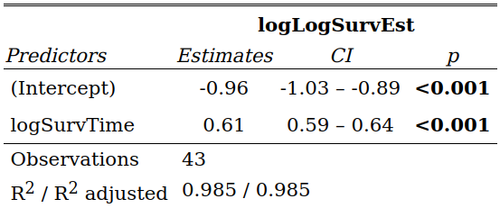

\newtheorem{definition}{Définition}
\newtheorem{exemple}{Exemple}
\newtheorem{corollary}{Corollaire}
\newtheorem*{proposition}{Proposition}
\newtheorem{lemma}{Lemme}
\newtheorem*{demonstration}{Démonstration}
\newtheorem{remark}{Remarque}
\newtheorem{propetie}{Propriété}
\newpage
\tableofcontents
\newpage
```{r setup, include=FALSE}
knitr::opts_chunk$set(echo = F, warning = F, message = F)
```

```{r library}
library(dplyr)
library(survival)
library(survminer)
library(timereg)
library(flexsurv)
```


\section{Introduction}

  Dans ce rapport nous avons cherché à comparer des modèles d'analyse de survie paramétriques et non-paramétriques sur un jeu de données ainsi que l'influence d'une covarianble sur la survie. Ici, nous traiterons surtout les modèles paramétriques vu au cours du semestre, les modèles non-paramétriques ayant été vu durant le semestre dernier (pour approfondir ce type de modèle vous pouvez retrouver notre travail ici [lien]).
 
 
  
  Lorsqu'on travaille avec des modèles de survie, on chercher à étudier des durées de survie d'une population donnée.  
La **durée de vie** (ou de survie) est le temps écoulé du début du suivi de l'individu (naissance) jusqu'à l'apparition de l'*évènement d'intérêt* (décès) pour les individus d'une population. On la note souvent $T$
  
  
  Dans notre étude, nous utiliserons un jeu de données sur les chefs d'états en place dans le monde entre 1946 et 2008, soit environ 1800 chefs d'états de 202 pays différents sur plus d'un demi siècle.  

  
  
```{r,out.width="50%",fig.align="center",echo = FALSE, include=TRUE}
# Read file
df <- read.csv(file = 'dd.csv', sep = ",", header= TRUE)
df <- as_tibble(df)

df <- df %>% ungroup() %>% select(-cowcode2,-politycode, - end_year)
sample <- sample_n(df,4)

sample <- sample %>% select(-un_region_name,-leaderspellreg,-democracy, -un_continent_name)
sample <- rename(sample,Gouv = ehead, Pays = ctryname, "Type de régime" = regime, "Date d'entrée" = start_year, Durée = duration, Statut = observed)

knitr::kable(sample,align = 'c', caption = "Extrait du jeu de données.")
```
  

Donc en termes de survie, les individus sont les chefs d'état, la durée de survie est la durée du mandat, l'évènement d'intérêt est la fin du mandat.
  
  
Puisque nous sommes dans le cadre des modèles de survie, nous n'avons pas toujours toutes les informations sur l'individu, dans le sens où son suivi dans l'étude peut être interrompu, c'est-à-dire que l'évènement d'intérêt n'est pas observé durant l'étude. On appelle ce phénomène la **censure**. Elle est codée comme une indicatrice de l'observation de l'évènement d'interêt : 1 si l'évènement est observé, 0 sinon.

*Formule ?* 
 
  Dans notre cas, la colonne **Statut** représente la censure. On se retrouvera donc confronté à de la censure (aléatoire et fixe) à droite, ceci signifie que l'évènement d'intérêt ne sera pas observé avant la fin de l'étude. 
Les cas de censures fixes sont les chefs d'état encore au pouvoir en 2008 (fin de l'étude).
Les cas de censures aléatoires sont les décès des chefs de gouvernements pendant leur mandat.
  
  
  Avant de commencer notre étude vérifions ce jeu de données est raisonnable (suffisamment de données) pour interpréter nos futurs résultats.
  
Pour cela calculons le pourcentage de censure de l'échantillon.
```{r taux_de_censure, echo = T}
n <- length(df$ehead) #nombre d'individus
delta <- df$observed #vecteur des censures
pourcentage_censure <- 1-sum(delta)/n
cat("Pourcentage de censure :", pourcentage_censure*100, "%")
```
On observe que le pourcentage de données censurées dans l'échantillon est d'environ $19 \%$ ce qui représente 340 individus censurés sur les plus de 1 800. On peut donc raisonnablement se dire que ce jeu de données est adapté à de l'analyse de survie.

 
 Dans notre étude nous avons choisi de regarder l'influence du type de régime sur la durée du mandat d'un chef d'état. La covariable que nous avons choisie d'étudier est qualitative dont les modalités sont : 
  - la monarchie
  - la dictature civile
  - la dictature militaire
  - la démocratie parlementaire
  - la démocratie présidentielle
  - et la démocratie mixte.
 
\newpage
\section{Analyse des données}


Dans les modèles de survie paramétriques, le temps est supposé suivre une certaine distribution dont la fonction de densité de probabilité $f(t)$ peut être exprimée en fonction de paramètres inconnus. Une fois qu'une fonction de densité de probabilité est désignée la variable de durée, les fonctions de survie et de risque correspondantes peuvent être déterminées.  
Les fonctions de survie $S(x)$ et de risque instantanné $h(x)$ sont reliées de la manière suivante:

\begin{proposition}
Soit $X : \Omega \longrightarrow \mathbb{R}_+$ une variable aléatoire de densité $f$, de fonction de survie $S$ et de risque instantanné $h$. Alors, on a les relations suivantes :
$$
h(x)= \dfrac{f(x)}{S(x)} = - \dfrac{d}{dx} \log \big(S(x) \big)
$$
\end{proposition}


\subsection{Modèle de Weibull sans covariables}
Le modèle de Weibull est un modèle largement utilisé en analyse de survie pour son interpretabilité et pour ses propriétés.
La fonction de risque instantanné pour une loi de Weibull$(\alpha,\lambda)$ avec $\alpha,\lambda >0$ est $h(x) = \alpha \lambda x^{\alpha -1}$.  
La fonction de survie est $S(x) = e^{-\lambda x ^{\alpha}}$  
Le modèle de Weibull possède les propriétés suivantes :
\begin{propetie}
Soit $X : \Omega \longrightarrow \mathbb{R}_+$ une variable aléatoire suivant une loi de Weibull de paramètres $\alpha,\lambda > 0$ de fonction de risque instantanné $h$. Alors, \\
$$
S(x) = e^{-\lambda x ^\alpha} \Rightarrow -\log(S(x)) = \lambda x ^{\alpha} \Rightarrow \log(-\log(S(x))) = \log(\lambda) + \alpha \log(x)
$$
\end{propetie}
  

La première prorpriété indique la linéarité de $log(-log(S(x)))$ en $log(x)$. Et donc, couplée à l'estimateur de la survie de Kaplan Meier dont le calcul est possible grâce au données, elle permet l'évaluation graphique de la validité du modèle.

En utilisant l'estimateur de Kaplan-Meier, nous allons ajuster un modèle de régression linéaire sur les données de survie:

```{r}

############################################################
##### Calcul log log S + plot ######### sans covariables ###
############################################################
result.km <- survfit(Surv(duration, observed) ~ 1, data = df)
survEst <- result.km$surv
survTime <- result.km$time
logLogSurvEst <- log(-log(survEst))
logSurvTime <- log(survTime)
result.lm <- lm(logLogSurvEst ~ logSurvTime)

#plot 
#plot(logLogSurvEst ~ logSurvTime, ylab = expression(log(log(hat(S(x))))), xlab = expression(log(x)),col ="#F75D59"  )
#abline(result.lm, col = "#6960EC")
```


```{r,,fig.show="hold",fig.align='center',fig.cap="Sortie R de la regression linéaire. La droite verte est la droite des moindres carrés. (Intercept) estime l'ordonnée à l'origine et logSurTime estime la pente de la droite des moindres carrés.", out.width="40%"}
# Graphic
plot(logLogSurvEst ~ logSurvTime, ylab = expression(log(log(hat(S(x))))), xlab = expression(log(x)),col ="#F75D59"  )
abline(result.lm, col = "#008080")

# End graphic 
```

Ainsi, nous pouvons récupérer la valeur estimée des paramètres du modèle de Weibull en passant par la transformation inverse du $\log$. Nous obtenons donc $\hat{\lambda}=\exp(-0.9621)=0.38$ et $\hat{\alpha}=0.612$. Notons qu'avec un $R^2$ de $0.985$, nous pouvons dire que sur notre jeu de données, les durées de vie des régimes (tout confondus) peut être décrite par une loi de Weibull


\subsection{Modèle paramétrique avec covariables}
\subsubsection{Par régime}
Les types de régimes peuvent être répartis en deux classes : les régimes démocratiques et les régimes non-démocratiques.
Les régimes démocratiques comprennent les démocraties mixtes, parlementaires et présidentielles. Les régimes non-démocratiques comprennent les dictatures civiles, militaires et les monarchies.  
Ceci introduit donc une covariable qu'on a nommé *Régime*,
Voici un extrait du nouveau tableau.


```{r}
#########################################################
################ Survreg  #### covariables ##############
#########################################################
###
### Extrait du tableau
###
sample_dem <- read.csv('sample_dem.csv')
knitr::kable(sample_dem,align = 'c', caption = "Nouvel extrait du tableau")
```

Afin de savoir sur quel modèle baser notre analyse, Nous évaluons le critère AIC avec le estimateurs du maximum de vraisemblance issus de la régression en considérant 6 différentes distributions. 

```{r, echo = F,fig.cap="Critère AIC par modèle"}
library(flexsurv)

#########################################
## AIC  #### covariable : régime ########
#########################################

democracy.weib <- flexsurvreg(Surv(duration, observed) ~ democracy, data = df, dist = 'weibull' )
democracy.llog <- flexsurvreg(Surv(duration, observed) ~ democracy, data = df, dist = 'llogis' )
democracy.exp <- flexsurvreg(Surv(duration, observed) ~ democracy, data = df, dist = 'exponential' )
democracy.lnorm <- flexsurvreg(Surv(duration, observed) ~ democracy, data = df, dist = 'lognormal' )
democracy.ga <- flexsurvreg(Surv(duration, observed) ~ democracy, data = df, dist = 'gamma' )
democracy.gomp <- flexsurvreg(Surv(duration, observed) ~ democracy, data = df, dist = 'gompertz' )

aic.table <- read.csv('aic_regime.csv')
knitr::kable(aic.table,align = 'c', caption = "Critère AIC par modèle.")


```

Le modèle Log-normal est celui dont le critère AIC est le plus petit . C'est sur ce modèle qu'on devrait baser notre étude. Cependant, une évaluation graphique des différents modèle nous suggère que la loi de Gompertz semble plus appropriée pour l'estimation des données de survie comme on peut voir sur les graphiques ci dessous.

```{r, echo = FALSE, fig.show='hold', out.width="33%",fig.cap = "Estimations paramétriques (Log-normal, Gompertz et Weibull) et non paramétriques du hasard cumulé. Les courbes en violet et en doré représentent l'estimation non paramétrique de la fonction de hasard cumulé. Les courbes en rouge designent à chaque fois le hasard cumulé des lois correspondantes"}
plot(democracy.lnorm, main = "Modèle Log-normal", xlab = "temps",ylab = "Estimation du hasard cumulé", ci = TRUE, col.obs = c("#b7950b", "#633974"), cl = 0.95, conf.int = TRUE, lwd = 2, lwd.obs = 1.5, type = "cumhaz")
legend(x="topleft",
       legend = c("Régimes démocratiques","Régimes non-démocratiques","log-normale"),
       lty =c(1,2,1,2,1,2),
       col = c("#b7950b","#633974","red"),
       lwd= 2)

plot(democracy.gomp, main = "Modèle Gompertz", xlab = "temps",ylab = "Estimation du hasard cumulé", ci = TRUE, col.obs = c("#b7950b", "#633974"), cl = 0.95, conf.int = TRUE, lwd = 2, lwd.obs = 1.5, type = "cumhaz")
legend(x="topleft",
       legend = c("Régimes démocratiques","Régimes non-démocratiques","Gompertz"),
       lty =c(1,2,1,2,1,2),
       col = c("#b7950b","#633974","red"),
       lwd= 2)

plot(democracy.weib, main = "Modèle Weibull", xlab = "temps",ylab = "Estimation du hasard cumulé", ci = TRUE, col.obs = c("#b7950b", "#633974"), cl = 0.95, conf.int = TRUE, lwd = 2, lwd.obs = 1.5, type ="cumhaz")
legend(x="topleft",
       legend = c("Régimes démocratiques","Régimes non-démocratiques","Weibull"),
       lty =c(1,2,1,2,1,2),
       col = c("#b7950b","#633974","red"),
       lwd= 2)


```


\newpage


Nous observons d'après le graphique que 


\subsubsection{Modèle de Weibull avec covariables}

Changement de paramétrisation avec R.

```{r survreg_weibull}
df$regime <- factor(df$regime, levels = c("Monarchy","Civilian Dict","Military Dict","Parliamentary Dem","Mixed Dem", "Presidential Dem"))

modweib <- survreg(Surv(df$duration,delta)~df$regime,init = "Monarchy" ,dist='weibull')
#summary(modweib)
modweib$coefficients/sqrt(diag(modweib$var)[-7]) # nombre de sigma pour s'annuler
```

```{r densité}
seq <- seq(0, 5, length.out = 100)
yweib <- dweibull(seq, modweib$coefficients[1], modweib$scale)

hist(df$duration, breaks = 50, freq = F, main = "", ylim = c(0,1.6))
lines(density(df$duration), col ="blue") # méthode à noyau
lines(seq, yweib, type = "l", col = "red")

```

Nous avons choisi la monarchie comme référent (`Intercept`) car c'est la modalité pour laquelle les duréees de vies sont les plus longues en moyenne comme on peut le voir sur une représentation graphique utilisant un estimateur non-paramétrique de Kaplan-Meier. (ou on fait un histogramme)

```{r Kaplan-Meier}
fit_regime <- survfit(Surv(duration,observed) ~ regime, data = df)

ggsurvplot(fit_regime,
          pval = TRUE, pval.method=T, pval.coord=c(25,0.8), pval.method.coor=c(25,0.9), conf.int = TRUE,
          linetype = "strata", # Change line type by groups
          surv.median.line = "hv", # Specify median survival
          ggtheme = theme_grey(base_size =  11), # Change ggplot2 theme
          break.time.by = 5,
          title="Courbes de survie des différents types de régimes",
          legend = c(0.85,0.809),
          legend.title = "Régimes",
          xlab= "Années", ylab="Probabilité de rester au pouvoir",
          legend.labs = c("Monarchie", "Dict. Civile", "Dict. militaire", "Démoc. mixte", "Démoc. parlementaire", "Démoc. présidentielle")
          )
```


\subsection{Modèle log-logistique}
\subsubsection{Fonction survreg}

\newpage
\section{Conclusion}

méthode non-paramétrique sert à valider la méthode paramétrique.

\newpage 
\section{Annexes et références}
  
  Références :
Cheibub, José Antonio, Jennifer Gandhi, and James Raymond Vreeland. 2010. “Democracy and Dictatorship Revisited.” Public Choice, vol. 143, no. 2-1, pp. 67-101.
